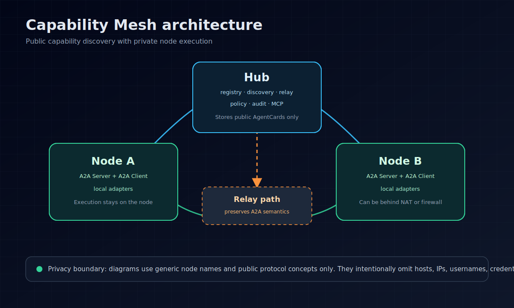
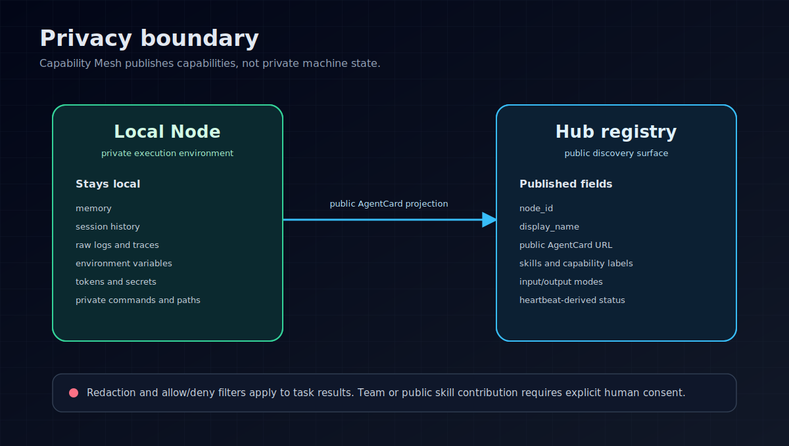

# Capability Mesh

[](https://github.com/Omvira/capability-mesh/actions/workflows/ci.yml)
[](https://www.python.org/)
[](pyproject.toml)

Capability Mesh is a privacy-first agent network for discovering, routing, and relaying A2A-capable nodes across machines.

It is built for the awkward real world: agents running on laptops, workstations, servers, CI jobs, and private networks that cannot all expose public ports. A central Hub keeps the public directory. Nodes keep their private runtime state. When two nodes can reach each other, they speak A2A directly. When they cannot, the Hub can publish a relay URL without turning itself into the executor of every task.

## Why this exists

Most agent orchestration systems assume one of two shapes:

- a single server that owns execution, logs, memory, routing, and credentials
- a set of local tools that work well on one machine but do not form a network

Capability Mesh sits between those two models. It gives teams a small registry, discovery, relay, policy, audit, and MCP surface while keeping node execution local.

The design goal is simple: publish capabilities, not private state.

Capability Mesh does not expose local memory, session history, raw logs, reasoning traces, environment variables, local skills, tokens, secrets, or private transport commands by default.

## Architecture



The diagram above is intentionally generic. It uses placeholder node names and public protocol concepts only. It does not include real hosts, IP addresses, usernames, local paths, credentials, memory, logs, or secrets.

```text
┌──────────────────────────────────────────────────────────────┐
│                            Hub                               │
│  registry · discovery · relay URLs · policy · audit · MCP     │
└───────────────┬──────────────────────────────┬───────────────┘
                │                              │
        AgentCard discovery              Relay when needed
                │                              │
┌───────────────▼──────────────┐   ┌───────────▼───────────────┐
│            Node A            │   │           Node B           │
│  A2A Server + A2A Client      │   │  A2A Server + A2A Client   │
│  local Hermes/Codex/MCP/etc.  │   │  local Shell/Python/etc.   │
└──────────────────────────────┘   └───────────────────────────┘
```

### Hub

The Hub coordinates the mesh. It stores public AgentCards, indexes skills and tags, serves the dashboard, exposes MCP tools, applies policy, writes audit records, and provides relay URLs for nodes behind NAT or firewalls.

The Hub is not the default executor. It should not rewrite A2A Task, Message, or Artifact semantics while relaying traffic.

### Node

A Node is the machine that actually owns a capability. It can expose an A2A endpoint, call other A2A nodes, and dispatch work to local adapters such as Hermes, Codex, OpenCode, MCP, Shell, or Python.

```text
Node = A2A Server + A2A Client + local execution adapters
```

### AgentCard

AgentCards are the public discovery documents. The Hub has an AgentCard. Each Node has an AgentCard. A Node AgentCard should describe public capabilities only: skills, tags, input/output modes, supported interfaces, and relay or direct URLs.

It must not include secrets, wake tokens, dispatch commands, environment variables, local paths, private logs, memory, sessions, or raw runtime state.

## Features

- Hub/Node architecture for distributed A2A agent networks
- Public AgentCard registry with skill and tag discovery
- Direct Node-to-Node A2A calls when nodes are mutually reachable
- Hub relay URLs for nodes behind NAT, firewalls, VPN boundaries, or personal machines
- A2A Protocol 1.0 HTTP+JSON endpoints validated with `a2a-sdk` models where practical
- SSE streaming and push notification configuration support
- Durable async task runtime with bounded workers, transitions, attempts, timestamps, and shutdown handling
- Bearer-token protection, policy files, JSONL audit logs, and secret redaction
- MCP stdio adapter for clients that prefer tool-style access
- Optional gRPC binding contract under `capability_mesh/grpc/a2a.proto`
- Static dashboard included in the Python package
- Legacy client assignment APIs preserved for compatibility

Production note: HTTP relay, gRPC helper, and long-poll tunnel APIs in this repository are Capability Mesh deployment bindings unless this README explicitly calls them A2A SDK models. Public A2A payloads are validated with Google A2A SDK models where practical. Relay forwarding preserves A2A Task, Message, and Artifact JSON semantics rather than rewriting them.

## Quick start

```bash
git clone https://github.com/Omvira/capability-mesh.git
cd capability-mesh

python3 -m venv .venv
. .venv/bin/activate
pip install -e '.[dev]'

capability-mesh --help
```

You can also run the module directly:

```bash
python3 -m capability_mesh.cli --help
```

Start a local Hub:

```bash
capability-mesh --mesh-home ~/.capability-mesh hub start \
  --host 127.0.0.1 \
  --port 8765
```

Check it:

```bash
curl -fsS http://127.0.0.1:8765/health
curl -fsS http://127.0.0.1:8765/.well-known/agent-card.json
```

Send an A2A message:

```bash
capability-mesh client \
  --url http://127.0.0.1:8765 \
  send-a2a --text "hello mesh"
```

Open the dashboard at:

```text
http://127.0.0.1:8765/
```

## Creating a Node manifest

A manifest describes the capabilities a node is willing to publish.

```bash
capability-mesh manifest \
  --node-id node-a \
  --display-name "Node A" \
  --task-type code_review \
  --task-type test_running \
  --tool python \
  --tool git \
  --output node-a.yaml
```

Good manifest entries are public labels:

- `code_review`
- `test_running`
- `python_debugging`
- `python`
- `git`
- `browser`
- `mcp`

Do not put private data in a manifest:

- API keys, tokens, passwords, or credentials
- environment variables
- private absolute paths
- memory, sessions, raw logs, or reasoning traces
- local skill contents
- dispatch commands or wake tokens

Validate the manifest:

```bash
capability-mesh validate node-a.yaml --kind manifest
```

## Generating a Node AgentCard

For a directly reachable node:

```bash
capability-mesh node agent-card \
  --manifest node-a.yaml \
  --public-url http://node-a.example.com/a2a
```

For a node reached through Hub relay:

```bash
capability-mesh node agent-card \
  --manifest node-a.yaml \
  --relay-url https://mesh.example.com/relay/nodes/node-a/a2a
```

A generated Node AgentCard contains the node name, public URL, HTTP+JSON A2A interface, skills, input/output modes, and streaming or push-notification declarations. It does not contain `transport.command`, `dispatch_command`, `wake_token`, secrets, or private runtime state.

## Registering a Node with the Hub

Register a directly reachable node:

```bash
capability-mesh --mesh-home ~/.capability-mesh hub register-node \
  --manifest node-a.yaml
```

Register a node that needs relay:

```bash
capability-mesh --mesh-home ~/.capability-mesh hub register-node \
  --manifest node-a.yaml \
  --relay-base-url https://mesh.example.com
```

The Hub will publish a relay URL like this:

```text
https://mesh.example.com/relay/nodes/node-a/a2a
```

List known agents:

```bash
capability-mesh --mesh-home ~/.capability-mesh hub agents
```

Search by skill:

```bash
capability-mesh --mesh-home ~/.capability-mesh hub agents \
  --skill code_review
```

## Communication patterns

### Direct A2A

Use this when two nodes can reach each other on the network.

```text
Node A -> Node B A2A endpoint
```

If Node B publishes this AgentCard URL:

```text
https://node-b.example.com/a2a
```

Node A can call Node B directly. The library includes `capability_mesh.node.client.NodeA2AClient`, which reads the target AgentCard `supportedInterfaces[].url`, sends an SDK-validated A2A message envelope to `{url}/message:send`, and validates `SendMessageResponse`.

Typical setups:

- same LAN
- VPN or Tailscale
- public HTTPS endpoints on both nodes

### Hub discovery, direct execution

```text
Node A -> Hub: search skill code_review
Hub -> Node A: return Node B AgentCard
Node A -> Node B: A2A call
```

The Hub helps Node A find Node B. It does not execute the task.

### Hub relay

Use this when the target node is behind NAT, a firewall, or a personal machine.

```text
Node A -> Hub relay URL -> reverse tunnel -> Node B
```

To Node A, the relay URL is still the AgentCard URL for Node B. The Hub forwards the request and preserves A2A Task IDs and protocol semantics.

The relay endpoint is:

```text
POST /relay/nodes/{node_id}/a2a/{operation}
```

This is a Capability Mesh HTTP relay, not an official A2A transport binding. If the target is unavailable, it returns:

```json
{"error":"relay target unavailable"}
```

The repository also includes a documented placeholder:

```text
GET /relay/pull/nodes/{node_id}
```

It returns an empty long-poll queue shape and marks `binding` as `custom-long-poll-placeholder`. Treat it as a placeholder for future tunnel/pull relay work, not as an official A2A binding.

## A2A message examples

Send a text message to the Hub's A2A Protocol 1.0 HTTP+JSON endpoint:

```bash
capability-mesh client \
  --url http://<HUB_HOST>:8765 \
  send-a2a --text "hello mesh"
```

Equivalent HTTP request:

```bash
curl -X POST http://<HUB_HOST>:8765/message:send \
  -H 'Content-Type: application/a2a+json' \
  -H 'Accept: application/a2a+json' \
  -d '{
    "message": {
      "role": "ROLE_USER",
      "parts": [
        {"text": "hello mesh"}
      ]
    }
  }'
```

Send an image FilePart:

```bash
capability-mesh client \
  --url http://<HUB_HOST>:8765 \
  send-a2a \
  --text "inspect image" \
  --image /path/to/example.png \
  --mime-type image/png
```

The stdlib HTTP+JSON endpoint returns a `SendMessageResponse` validated through the official `a2a-sdk` protobuf model:

```json
{
  "task": {
    "id": "a2a-...",
    "contextId": "a2a-...",
    "status": {
      "state": "TASK_STATE_COMPLETED"
    },
    "history": [],
    "artifacts": []
  }
}
```

## Async tasks, streaming, and push

The Hub AgentCard declares `streaming=true` and `pushNotifications=true`.

- `POST /message:stream` returns official `StreamResponse` events over SSE.
- `/tasks/{task_id}/push-notification-configs` stores and returns official `TaskPushNotificationConfig` objects.
- When an async task completes, the Hub posts an official `Task` object to configured webhooks.
- `POST /a2a/jsonrpc` supports `message/send`, `tasks/get`, `tasks/list`, and `tasks/cancel`.
- A2A responses are validated through official `a2a-sdk` protobuf models.

To run a long task asynchronously, set `capabilityMesh.async=true` in message metadata. The Hub first returns `202` and `TASK_STATE_WORKING`, then updates the task to `TASK_STATE_COMPLETED` when background work finishes. Durable runtime records live under `runtime/tasks`.

```json
{
  "message": {
    "role": "ROLE_USER",
    "parts": [{"text": "run async"}],
    "metadata": {"capabilityMesh": {"async": true, "delaySeconds": 0.5}}
  }
}
```

## HTTP API reference

Hub and service endpoints:

```text
GET  /health
GET  /.well-known/agent-card.json
GET  /agent-card.json
GET  /api/agent-card

GET  /api/nodes
GET  /api/nodes/{node_id}
POST /api/nodes
GET  /api/nodes/statuses
POST /api/nodes/{node_id}/heartbeat

GET  /tasks
GET  /tasks/{task_id}
POST /tasks/{task_id}:cancel
POST /message:send
POST /message:stream
POST /a2a/jsonrpc
GET  /tasks/{task_id}/push-notification-configs
POST /tasks/{task_id}/push-notification-configs
GET  /relay/pull/nodes/{node_id}
POST /api/a2a/messages
POST /api/a2a/tasks/send
GET  /api/a2a/tasks

GET  /api/tasks
POST /api/tasks
POST /api/tasks/plan
POST /api/tasks/plan-step
POST /api/tasks/route

GET  /api/assignments
POST /api/assignments
GET  /api/nodes/{node_id}/assignments
POST /api/assignments/{assignment_id}/claim
POST /api/assignments/{assignment_id}/wake
POST /api/assignments/{assignment_id}/complete

GET  /api/results
POST /api/results
```

## Production baseline

Run the Hub on `127.0.0.1` behind a TLS reverse proxy, or expose it only inside a trusted LAN/VPN. Do not publish an unauthenticated mutating API to the internet.

Set a bearer token:

```bash
export CAPABILITY_MESH_AUTH_TOKEN='[REDACTED]'
capability-mesh --mesh-home /var/lib/capability-mesh hub start \
  --host 127.0.0.1 \
  --port 8765
```

`--auth-token` can also be passed explicitly. If not provided, the Hub reads `CAPABILITY_MESH_AUTH_TOKEN`.

Recommended production settings:

- store `CAPABILITY_MESH_HOME` in a durable directory, such as `/var/lib/capability-mesh`
- inject `CAPABILITY_MESH_AUTH_TOKEN` from an env file or secret manager reference
- install an explicit `policy.yaml`
- use deny-by-default policy in production
- keep `audit.log` enabled for JSONL audit records
- put the Hub behind nginx or another TLS reverse proxy
- use systemd or docker-compose from `deploy/` for service management

Example `policy.yaml`:

```yaml
default: deny
allow:
  - message:send
  - message:stream
  - tasks/*
  - api/nodes
  - api/nodes/*/heartbeat
deny:
  - relay/*
```

Audit records include timestamp, action, status, path, remote address, optional node ID, redacted headers, and redacted body. Push delivery attempts are stored under `push-deliveries`; bearer credentials are not written to audit or delivery records.

The gRPC adapter is optional and generated-free by default. `capability_mesh.grpc.binding` provides SDK-validated JSON helpers. If you need concrete stubs, install `.[grpc]` and generate them from `capability_mesh/grpc/a2a.proto`.

## MCP stdio adapter

Capability Mesh can run as an MCP stdio server.

Install MCP dependencies:

```bash
pip install -e '.[mcp]'
```

Start the MCP server:

```bash
capability-mesh mcp-server \
  --mesh-url http://<HUB_HOST>:8765
```

Example MCP client configuration:

```json
{
  "mcp_servers": {
    "capability-mesh": {
      "command": "<PYTHON_EXECUTABLE>",
      "args": [
        "-m",
        "capability_mesh.cli",
        "mcp-server",
        "--mesh-url",
        "http://<HUB_HOST>:8765"
      ],
      "env": {}
    }
  }
}
```

Available MCP tools:

- `list_clients`
- `get_client`
- `call_client_async`
- `create_assignment`
- `get_assignment_status`
- `send_a2a_message`

The MCP adapter returns JSON-serializable public fields only. It does not expose wake tokens, wake URLs, dispatch commands, transport commands, private logs, memory, sessions, environment variables, or secrets.

## Python API

```python
from capability_mesh.core import build_default_capability_manifest
from capability_mesh.hub import list_agent_cards, register_node_agent_card
from capability_mesh.node import build_node_agent_card

manifest = build_default_capability_manifest(
    node_id="node-a",
    display_name="Node A",
    task_types=["code_review"],
    tools_available=["python", "git"],
)

card = build_node_agent_card(
    manifest,
    relay_url="https://mesh.example.com/relay/nodes/node-a/a2a",
)

print(card["name"])
print(card["supportedInterfaces"][0]["url"])

register_node_agent_card(
    manifest,
    relay_base_url="https://mesh.example.com",
)

print(list_agent_cards())
```

HTTP client:

```python
from capability_mesh.client import CapabilityMeshClient

client = CapabilityMeshClient("http://<HUB_HOST>:8765")
print(client.health())
print(client.agent_card())
print(client.list_nodes())
```

## Legacy client loop

The legacy `client` commands still support lightweight remote node registration, heartbeat, and assignment polling.

Interactive install:

```bash
capability-mesh client \
  --url http://<HUB_HOST>:8765 \
  install
```

Non-interactive registration with one heartbeat:

```bash
capability-mesh client \
  --url http://<HUB_HOST>:8765 \
  install \
  --yes \
  --node-id node-a \
  --display-name "Node A" \
  --task-type code_review \
  --tool python \
  --once
```

Keep a node online:

```bash
capability-mesh client \
  --url http://<HUB_HOST>:8765 \
  heartbeat-loop node-a \
  --interval 30
```

Run the legacy work loop from a manifest:

```bash
capability-mesh client \
  --url http://<HUB_HOST>:8765 \
  loop ~/.capability-mesh/client/node-a.manifest.json \
  --interval 30 \
  --run-next
```

This mode remains for compatibility. New deployments should prefer Hub, Node, AgentCard, and A2A communication.

## Command reference

```bash
# Help
capability-mesh --help
capability-mesh hub --help
capability-mesh node --help

# Start Hub
capability-mesh --mesh-home ~/.capability-mesh hub start --host 127.0.0.1 --port 8765

# Build manifest
capability-mesh manifest --node-id node-a --display-name "Node A" --task-type code_review --tool python -o node-a.yaml

# Validate manifest
capability-mesh validate node-a.yaml --kind manifest

# Build Node AgentCard
capability-mesh node agent-card --manifest node-a.yaml --relay-url https://mesh.example.com/relay/nodes/node-a/a2a

# Register Node with Hub registry
capability-mesh --mesh-home ~/.capability-mesh hub register-node --manifest node-a.yaml --relay-base-url https://mesh.example.com

# List agents
capability-mesh --mesh-home ~/.capability-mesh hub agents

# Search agents by skill
capability-mesh --mesh-home ~/.capability-mesh hub agents --skill code_review

# A2A message smoke test
capability-mesh client --url http://127.0.0.1:8765 send-a2a --text "hello mesh"

# Tests
pytest -q
```

## Privacy model



Capability Mesh defaults to public projection. A node publishes the small amount of information required for discovery and routing. Everything else stays local unless the node explicitly chooses to return it as part of a task result.

Public Node information should be limited to:

- `node_id`
- `display_name`
- public AgentCard URL
- public skills
- public capability labels
- heartbeat-derived status

Capability Mesh does not upload or expose these fields by default:

- local skills
- memory
- session history
- reasoning traces
- raw logs
- environment variables
- secrets
- tokens
- passwords
- API keys
- private transport commands
- dispatch commands
- wake tokens

Task results pass through allow/deny field filtering, and secret-like strings are redacted. Team or public skill contribution requires explicit human consent.

## Development

Install development dependencies and run the test suite:

```bash
pip install -e '.[dev]'
pytest -q
```

The CI workflow runs the same test command on Python 3.11.

## Deployment assets

The `deploy/` directory contains production-oriented examples:

- `deploy/nginx-capability-mesh.conf`
- `deploy/capability-mesh.service`
- `deploy/docker-compose.yml`

The `tutorial/` directory contains a LAN Hub plus PC clients walkthrough.

## Design principles

- Nodes own execution.
- The Hub owns discovery, relay, policy, and audit.
- Direct A2A is preferred when nodes are reachable.
- Relay is a network bridge, not a protocol rewrite layer.
- Public AgentCards describe capabilities, not secrets.
- Compatibility APIs can remain, but new deployments should use Hub/Node/A2A.

```text
Node A = A2A Client + A2A Server
Node B = A2A Client + A2A Server
Hub    = Registry + Discovery + Relay + Policy + Audit
```

## License

MIT. See `pyproject.toml` for the declared package license.
